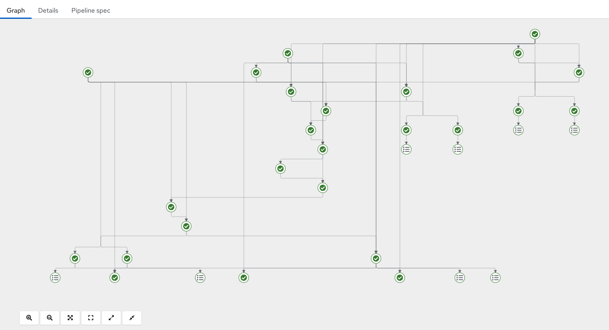
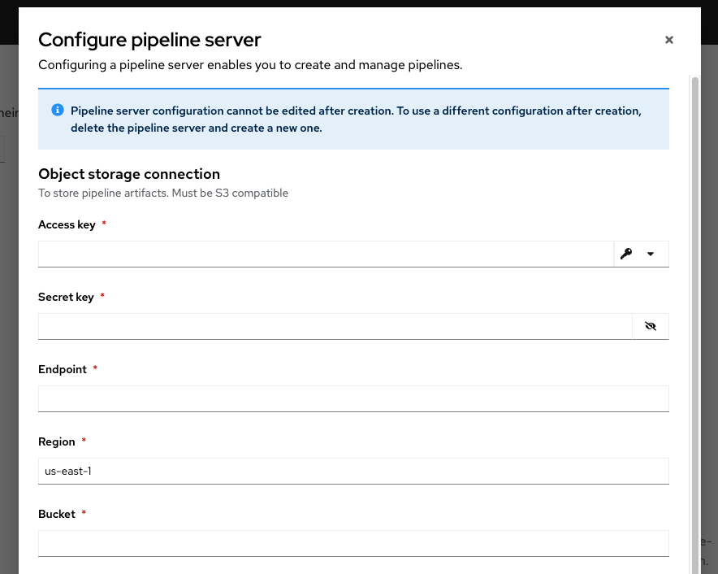
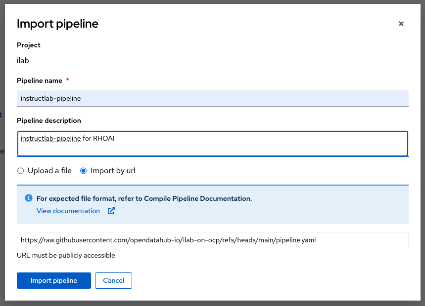
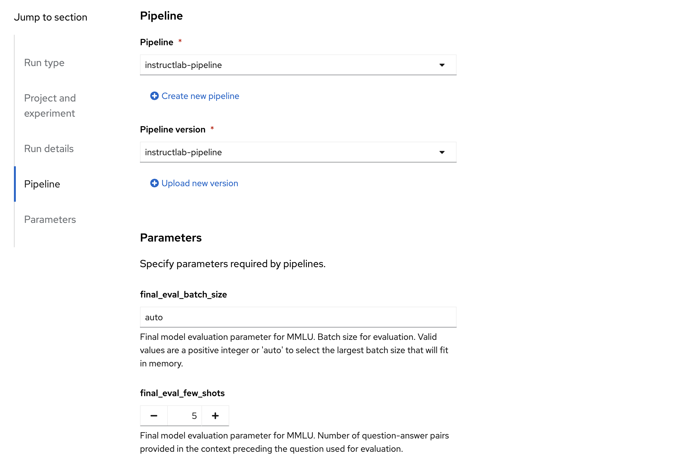

# InstructLab on Red Hat OpenShift AI

This repo will serve as the central location for the code, Containerfiles and yamls needed to deploy [Instructlab](https://instructlab.ai/) onto an [OpenShift](https://www.redhat.com/en/technologies/cloud-computing/openshift) cluster with [Red Hat OpenShift AI (RHOAI)](https://www.redhat.com/en/technologies/cloud-computing/openshift/openshift-ai). This project leverages a number of the tools included with RHOAI working together to run InstructLab. Specifically, Data Science Pipelines for application orchestration, Kserve Serving for model serving, and the Distributed Training Operator to run our model training across multiple GPU enabled nodes.


<p align="center"></p>


## Getting Started

This project makes running the InstructLab large language model (LLM) fine-tuning process easy and flexible on OpenShift. However, before getting started there are a few prerequisites and additional setup steps that needs to be completed.

### Cluster Requirements

#### Operators:
The following Operators must be installed on your OpenShift cluster:

* [Red Hat OpenShift AI](https://docs.redhat.com/en/documentation/red_hat_openshift_ai_cloud_service/1/html/installing_and_uninstalling_openshift_ai_cloud_service/installing-and-deploying-openshift-ai_install)
* [Node Feature Discovery and NVIDIA GPU Operators](https://docs.redhat.com/en/documentation/red_hat_openshift_ai_cloud_service/1/html/installing_and_uninstalling_openshift_ai_cloud_service/enabling-nvidia-gpus_install)

#### Training operator
Within the DataScienceCluster definition the following must be defined and set to managed under Spec -> Components.

``` bash
oc edit dsc
      trainingoperator:
        managementState: Managed
```

To verify the PytorchJob is available in the cluster run the following.

```bash
oc get pytorchjob
```

If an error is shown PyTorch is not available in cluster.

#### Object Storage:

Once the above operators have been successfully installed, you will need to set up object storage for your models and pipeline artifacts. This solution requires object storage to be in place through S3 compatible storage such as [Noobaa](https://www.noobaa.io/).

1. If using Noobaa, apply the following [tuning paramters](noobaa/README.md).
2. Create an `Object Bucket Claim` in your namespace. This will serve as the artifact store for your Data Science Pipeline.


#### Configure Data Science Pipeline Server:

From within the RHOAI dashboard, navigate to the "Data Science Pipelines" page and click "Configure pipeline server". This will present you with a form where you can upload the credentials for the S3 bucket you created in the previous step.

<p align="center"></p>


#### Accelerator Profile:
An accelerator profile must also be defined within the RHOAI dashboard or via CLI to enable GPU acceleration for model serving with Kserve Serving.

```
apiVersion: v1
items:
- apiVersion: dashboard.opendatahub.io/v1
  kind: AcceleratorProfile
  metadata:
    name: gpu
    namespace: redhat-ods-applications
  spec:
    displayName: gpu
    enabled: true
    identifier: nvidia.com/gpu
    tolerations: []
```

#### Signed Certificate:
A signed certificate ensures that there are not any unnecessary issues when running the training pipeline.

To deploy a signed certificate in your cluster follow [trusted cluster cert](signed-certificate/README.md) documentation.

#### Teacher and Judge Models:

In addition to model training, InstructLab also performs Synthetic Data Generation (SDG) and Model Evaluation. In both cases another LLM is required to complete these steps. Since these models do not change frequently, we recommend serving them independent of the specific InstructLab pipeline. This allows these these models to be used as a shared resources across the organization.

1. Deploy the Teacher Model following these [instructions](/kubernetes_yaml/mixtral_serve/README.md).
2. Deploy the Judge Model following these [instructions](/kubernetes_yaml/prometheus_serve/README.md).

Once these two model servers are deployed, we need to add the following configmaps and secrets to our namespace so that the InstructLab pipeline can successfully communicate with each model.

```yaml
kind: ConfigMap
apiVersion: v1
metadata:
  name: teacher-server
data:
  endpoint: '<YOUR_MIXTRAL_MODEL_ENDPOINT>'
  model: mixtral
```

```yaml
kind: Secret
apiVersion: v1
metadata:
  name: teacher-server
data:
  api_key: <YOUR_MIXTRAL_API_KEY>
type: Opaque
```

```yaml
kind: ConfigMap
apiVersion: v1
metadata:
  name: judge-server
data:
  endpoint: '<YOUR_PROMETHEUS_MODEL_ENDPOINT>'
  model: prometheus
```

```yaml
kind: Secret
apiVersion: v1
metadata:
  name: judge-server
data:
  api_key: <YOUR_PROMETHEUS_API_KEY>
type: Opaque
```


### Run the Pipeline

Now that all the cluster requirements have been setup, we are ready to upload and run our InstructLab pipeline!

#### Upload the Pipeline:

Now we can go back to our RHOAI Data Science Pipelines dashboard and select **"Import pipeline"**. We recommend importing the pipeline yaml directly from the github repo using: `https://raw.githubusercontent.com/opendatahub-io/ilab-on-ocp/refs/heads/main/pipeline.yaml`
<p align="center"></p>

#### Create a Run:
Once the pipeline is uploaded we will be able to select **"Create run"** from the **"Actions"** dropdown. This will present us with a number of parameters we can set to customize our run. Click **"Create run"** at the bottom of the page to kick off your InstructLab pipeline.

<p align="center"></p>

#### Available Pipeline Parameters:

| Parameter | Definition |
|---------- | ---------- |
|`sdg_repo_url` | SDG parameter. Points to a taxonomy git repository|
|`sdg_repo_branch` | SDG parameter. Points to a branch within the taxonomy git repository. If set, has priority over sdg_repo_pr|
|`sdg_repo_pr` |SDG parameter. Points to a pull request against the taxonomy git repository|
|`sdg_base_model` |SDG parameter. LLM model used to generate the synthetic dataset|
|`sdg_scale_factor` |SDG parameter. The total number of instructions to be generated|
|`sdg_pipeline` |SDG parameter. Data generation pipeline to use. Available: 'simple', 'full', or a valid path to a directory of pipeline workflow YAML files. Note that 'full' requires a larger teacher model, Mixtral-8x7b.|
|`sdg_max_batch_len` |SDG parameter. Maximum tokens per gpu for each batch that will be handled in a single step.|
|`train_nproc_per_node` |Training parameter. Number of GPUs per each node/worker to use for training.|
|`train_nnodes` |Training parameter. Number of nodes/workers to train on.|
|`train_num_epochs_phase_1` |Training parameter for in Phase 1. Number of epochs to run training.|
|`train_num_epochs_phase_2` |Training parameter for in Phase 2. Number of epochs to run training.|
|`train_effective_batch_size_phase_1` |Training parameter for in Phase 1. The number of samples in a batch that the model should see before its parameters are updated.|
|`train_effective_batch_size_phase_2` |Training parameter for in Phase 2. The number of samples in a batch that the model should see before its parameters are updated.|
|`train_learning_rate_phase_1` |Training parameter for in Phase 1. How fast we optimize the weights during gradient descent. Higher values may lead to unstable learning performance. It's generally recommended to have a low learning rate with a high effective batch size.|
|`train_learning_rate_phase_2` |Training parameter for in Phase 2. How fast we optimize the weights during gradient descent. Higher values may lead to unstable learning performance. It's generally recommended to have a low learning rate with a high effective batch size.|
|`train_num_warmup_steps_phase_1` |Training parameter for in Phase 1. The number of steps a model should go through before reaching the full learning rate. We start at 0 and linearly climb up to train_learning_rate.|
|`train_num_warmup_steps_phase_2` |Training parameter for in Phase 2. The number of steps a model should go through before reaching the full learning rate. We start at 0 and linearly climb up to train_learning_rate.|
|`train_save_samples` |Training parameter. Number of samples the model should see before saving a checkpoint.|
|`train_max_batch_len` |Training parameter. Maximum tokens per gpu for each batch that will be handled in a single step.|
|`train_seed` |Training parameter. Random seed for initializing training.|
|`mt_bench_max_workers` |MT Bench parameter. Number of workers to use for evaluation with mt_bench or mt_bench_branch. Must be a positive integer or 'auto'.|
|`mt_bench_merge_system_user_message` |MT Bench parameter. Boolean indicating whether to merge system and user messages (required for Mistral based judges)|
|`final_eval_max_workers` |Final model evaluation parameter for MT Bench Branch. Number of workers to use for evaluation with mt_bench or mt_bench_branch. Must be a positive integer or 'auto'.|
|`final_eval_few_shots` |Final model evaluation parameter for MMLU. Number of question-answer pairs provided in the context preceding the question used for evaluation.|
|`final_eval_batch_size` |Final model evaluation parameter for MMLU. Batch size for evaluation. Valid values are a positive integer or 'auto' to select the largest batch size that will fit in memory.|
|`final_eval_merge_system_user_message` |Final model evaluation parameter for MT Bench Branch. Boolean indicating whether to merge system and user messages (required for Mistral based judges)|
|`k8s_storage_class_name` |A Kubernetes StorageClass name for persistent volumes. Selected StorageClass must support RWX PersistentVolumes.|


### Customize the Pipeline

The `pipeline.yaml` provided in this repo will always represent the most up to date version of the pipeline as our team continues to improve upon it as well as keep it in line with the InstructLab CLI. However, if you are a contributor or simply want to experiment with making custom changes to the pipeline that can be done by simply editing and "compiling" the `pipeline.py` file provided in this repo.

The pipeline yaml is defined by `pipeline.py` file and then converted into an intermediate representation yaml that Data Science Pipelines expects via the KubeFlow Pipelines python SDK. If you want to customize the pipeline in anyway, you can update `pipeline.py`, run the below make command and then upload the pipeline to your Data Science Pipeline instance similar to how we showed [above](#upload-the-pipeline).

```bash
make pipeline
```

## Standalone Deployment

See [standalone](standalone/README.md) for instructions on deploying the Instructlab solution
without the need for RHOAI.
To generate the `standalone.py` script, run the following command ([ruff](https://docs.astral.sh/ruff/installation/) tool must be installed):

```bash
make standalone
```

## Developer setup

To collaborate on this repository, please follow these steps:

1. Install [uv](https://docs.astral.sh/uv/getting-started/installation/)
2. Run following commands to prepare your local environment
    ```bash
    uv sync
    source .venv/bin/activate
    ```
