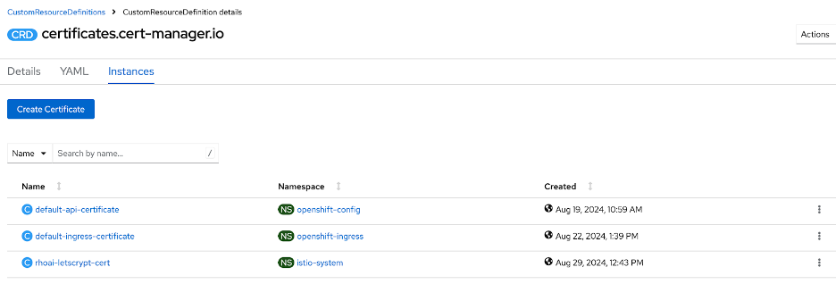
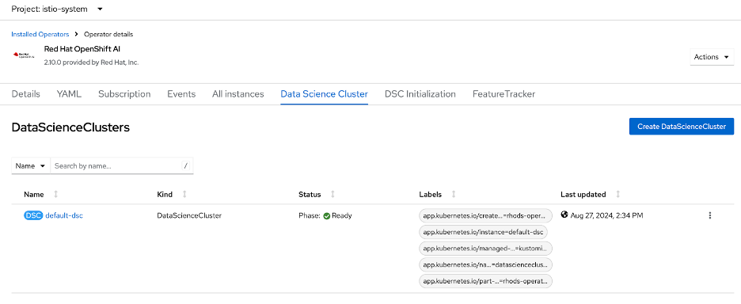
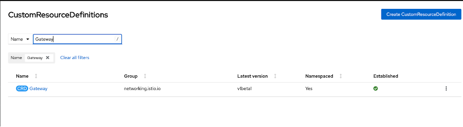
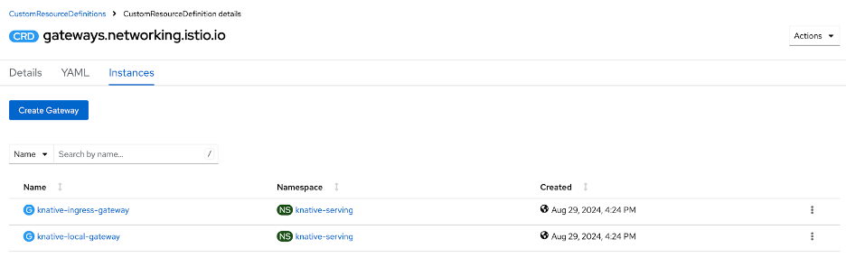
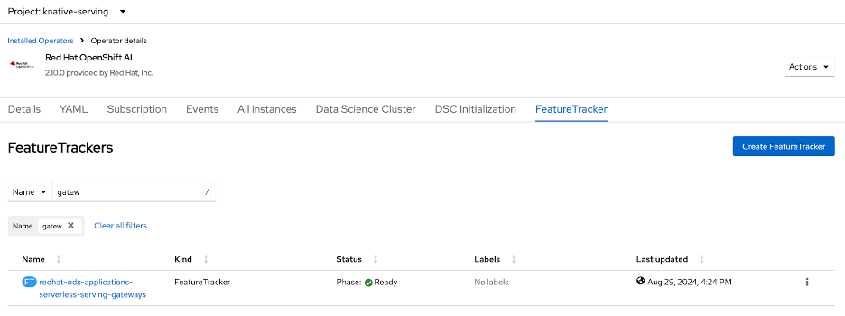
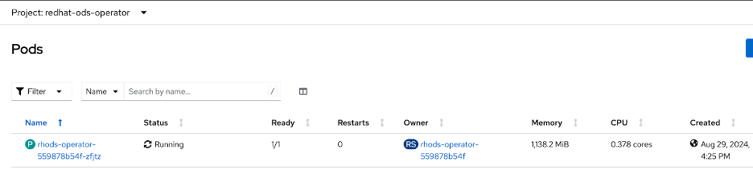

# Configure KServe to use signed certificates

The endpoint url for vLLM inference servers that are deployed using vLLM Serving Runtime are insecure. To configure the KServe to use signed certificates to generate secure routes

## Create an Issuer for the istio-system namespace

1. Copy secrets **letsencrypt-production-key** and **aws-route53-credentials** from **openshift-ingress** namespace into **istio-system** namespace.

2. Create an **Issuer** for the **istio-system** namespace
   i. Navigate to **Administration** → **Custom Resource Definitions** → **Issuer**
   ii. Create an Issuer based upon an existing Issuer in the istio-system.

    ```
    apiVersion: cert-manager.io/v1
    kind: Issuer
    metadata:
    name: letsencrypt-production-dns01
    namespace: istio-system
    labels:
        nerc.mghpcc.org/kustomized: 'true'
    spec:
    acme:
    email: help@nerc.mghpcc.org
    privateKeySecretRef:
        name: letsencrypt-production-key
    server: 'https://acme-v02.api.letsencrypt.org/directory'
    solvers:
        - dns01:
            cnameStrategy: Follow
            route53:
            accessKeyIDSecretRef:
                key: AWS_ACCESS_KEY_ID
                name: aws-route53-credentials
            region: us-east-1
            secretAccessKeySecretRef:
                key: AWS_SECRET_ACCESS_KEY
                name: aws-route53-credentials
        selector:
            dnsZones:
            - ocp-beta-test.nerc.mghpcc.org
    ```

## Create a Certificate for istio-system namespace

1. Navigate to **Administration** → **Custom Resource Definitions** → **Issuer**

   

2. Create a Certificate **rhoai-letscrypt-cert** based upon existing certificate **default-ingress-certificate**

    ```
    apiVersion: cert-manager.io/v1
    kind: Certificate
    metadata:
    name: rhoai-letscrypt-cert
    namespace: istio-system
    spec:
    dnsNames:
    - '*.apps.ocp-beta-test.nerc.mghpcc.org'
    duration: 2160h0m0s
    issuerRef:
    kind: Issuer
    name: letsencrypt-production-dns01
    renewBefore: 360h0m0s
    secretName: rhoai-letscrypt-cert
    ```

3. A secret **rhoai-letscrypt-cert** should be created in the **istio-system** namespace

## Update KServe configuration to use signed certificates

1. Navigate to **Operators → Installed Operators → Red Hat OpenShift AI → Data Science Cluste**r

   

2. Click on **default-dsc → YAML**
3. For the kserve component update the certificate section to use the provided certificate. Secret name should be the same as you configured while creating the certificate.

    ```
    spec:
    components:
    codeflare:
        managementState: Managed
    kserve:
        managementState: Managed
        serving:
        ingressGateway:
            certificate:
            secretName: rhoai-letscrypt-cert
            type: Provided
        managementState: Managed
        name: knative-serving
    ```

## Verify if the operator has reconciled Gateway configuration

The rhoai-operator does not reconcile the Gateway correctly. To verify if the operator has reconciled correctly

1. Navigate to the Administration → Custom Resource Definitions → Gateway

    

2. Click on Gateway → Instances

    

3. Click on knative-ingress-gateway → YAML. Verify that the **tls** section is present.

    ```
    apiVersion: networking.istio.io/v1beta1
    kind: Gateway
    metadata:
    name: knative-ingress-gateway
    namespace: knative-serving
    spec:
    selector:
    knative: ingressgateway
    servers:
    - hosts:
        - '*.apps.ocp-beta-test.nerc.mghpcc.org'
        port:
        name: https
        number: 443
        protocol: HTTPS
        tls:
        credentialName: rhoai-letscrypt-cert
        mode: SIMPLE
    ```

4. If the tls section is not present, force the operator to reconcile manually:

   i. Navigate to **Operators** → **Installed Operators** → **Red Hat OpenShift AI** → **Feature Tracker**
   ii. Search for Gateways and delete the Feature Tracker. It will be recreated.

    

   iii. Navigate to Workload → Pods in the r**edhat-ods-operator**

    

   iv. Delete the rhodes-operator pod. It will be recreated.
   v. Verify the Gateway Instance as described above.
